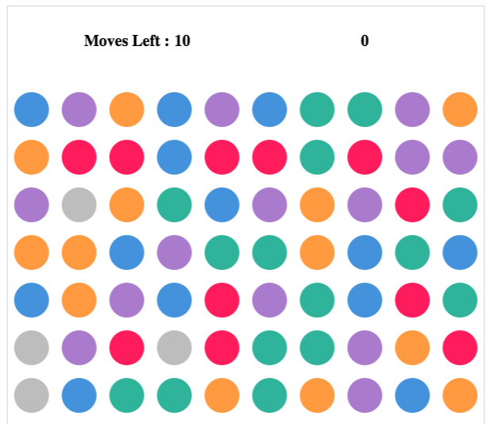

* Gem Match

* [Gem Match Live Site](https://nathashas1.github.io/GEM-MATCH/index.html)

## Screenshot


* Overview
	Gem Match is a simple and easy game to pick up quickly. The extent of the gameplay is clicking on the gems to swap them and find 3 matching gems in a row or column to eliminate that row/column.

	Game will have limited number of moves.You have to reach  a particular score with in that limited moves to win.

  This game is inspired by classic arcade games, particularly Bejewel Match and Candy Crush Saga. I am envisioning a colorful design and simple gameplay to keep the player engaged.


* Functionality and MVP Features
    * Users can use mouse clicks to select the gem they want to flip first, then select the adjacent gem they want to swap with.
    * More gems will be generated as the old ones get eliminated.
    * The game ends if the user gets required points or there are no available moves.


* WireFrames
    * The app will consist of a single page with a play button, a scoreboard, links to the Github repository and developer LinkedIn.
    * Upon pressing start game the game starts and a single line of text with instructions on the screen fade out and the game starts.
    * You can restart the game at any point in time.


  * Technologies employed
    *  Vanilla JavaScript for game logic.
    *  HTML5 Canvas for rendering.
    *  CSS for styling.


		 ## Code Samples
		 * User clicks were registered as first and second selections.

		 ```javascript
		 function clickHandler(e) {
		 	playAudio(music1);
		 	if (x1 === -1) {
		 		x1 = Math.floor(e.offsetX/60);
		 		y1 = Math.floor(e.offsetY/60)-2;
		 		color1 = balls[x1][y1].color;
		 	} else {
		 		x2 = Math.floor(e.offsetX/60);
		 		y2 = Math.floor(e.offsetY/60)-2;
		 		color2 = balls[x2][y2].color;
		 		let adjacent = checkAdjacent();

		 		if (adjacent) {
		 			swap(x1,y1,x2,y2);
		 		}
		 		x1 = -1;
		 		y1 = -1;
		 	}
		 }
		 ```

		 * When user swaps 2 balls and if there are 3 balls of the same color in a row or column they disappear.

```javascript
function removeBalls(array, slideCount){
	let i = 0;
	while (i < array.length) {
		playAudio(music3);
		delete balls[array[i][0]][array[i][1]];
		i+=1 ;
	}
	score += array.length*10;
	paint(slideCount);
	}

});
```
